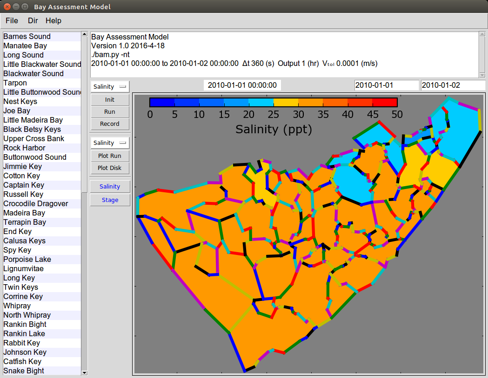

## Florida Bay Assessment Model (BAM)

BAM is a 'basins' hydrological model of Florida Bay.  It is mass-conservative and explicitly designed to assess water levels and salinities in 54 idealized basins representing Florida Bay.  Basins are separated and connected by shoals, thereby the model conforms to a linked-node network hierarchy with basins as nodes and shoals as links.

Model inputs include rainfall, evaporation, tidal elevations and freshwater runoff from the Everglades.  Interbasin fluxes are driven by hydraulic gradients developed across the shoals in response to water level elevations and are modeled with Manning's equation.

A good place to start are the docstrings in `Notes.py`, and a perusal of the command line options (e.g. `./bam.py -h`).

### Important options for run control

Switch|Description|Example
------|-----------|-------
-p PATH|Top level path of BAM|-p /opt/hydro/models/PyBAM/
-t TIMESTEP|timestep (s)|-t 360
-S START|Start date time|-S "2010-01-01 00:00"
-E END|End date time|-E "2010-01-01 08:00"
-oi OUTPUTINTERVAL|Time interval (hr) of output data|-oi 1
-bo BASINOUTPUTDIR|Directory to write basin outputs|-bo ~/BAM.out

### Notes

In a departure from traditional numerical models, BAM is pure 
